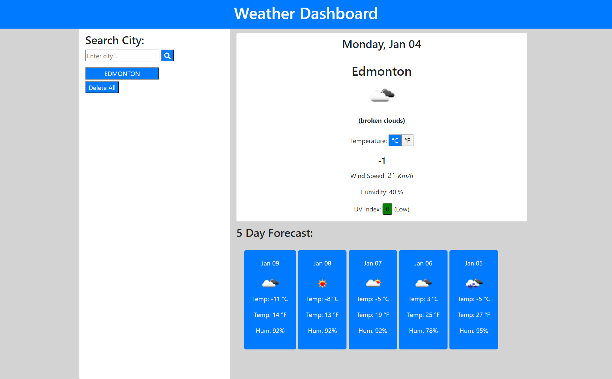
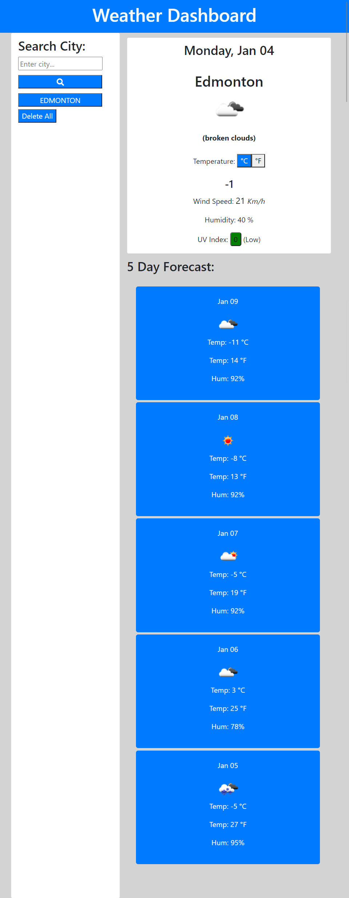
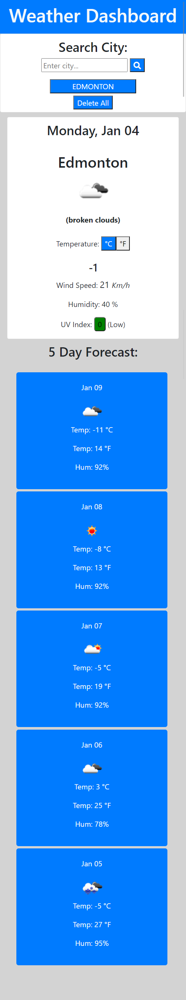

# Weather Dashboard
This is a weather dashboard that allows you to see the weather outlook for multiple cities so you can plan a trip accordingly.

## Table of Contents
* [General Information](#general-information)
* [Technology](#technology)
* [Deployment](#deployment)
* [Screenshots](#screenshots)
* [Credits](#credits)
* [License](#license)

## General Information
There are several reasons why weather forecasts are important. Weather forecasts helps people prepare for how to dress (i.e. warm weather, cold weather, windy weather, rainy weather), helps people prepare if they need to take extra gear to prepare for the weather (i.e. umbrella, rain coat, sun screen) and well as helps people know outside weather dangers, among other important reasons.

#### Once you enter the valid city:
- You are given the current and future conditions for that city.
- You are given the city name, the date, an icon representation of weather conditions, the temperature, the humidity, the wind speed, and the UV index (indicates uv condition)
- The temperature is diplayed in both celsius and fahrenheit. You are able to toggle between both fro the current weather infromation.
- The searched city name then appears on the search history.

#### If you click on a city in the search history
- You are given the current and future conditions for that city.

#### When the open the weather dashboard.
- If you have cities in your search history, you are given the current and future conditions for the last searched city.

## Technology

* [Localstorage](https://developer.mozilla.org/en-US/docs/Web/API/Window/localStorage)
* [jQuery](https://jquery.com/)
* [OpenWeather API](https://openweathermap.org/api)
* [Bootstrap](https://getbootstrap.com/)

## Deployment

A web browser is need to view page.

* Github page: [https://nashwalters.github.io/weather-dash/](https://nashwalters.github.io/weather-dash/)

* To open in a new window, copy and paste: https://nashwalters.github.io/weather-dash/

## Screenshots
The user interface is responsive and adapts to all screen sizes. Click on the arrows to drop down more images at various screen sizes.

  
Large Screen

  

  
Medium Screen

   

  
Small Screen

   

## Credits

* Carleton University Coding Bootcamp team
* [Adam Simonini](https://github.com/adamsimonini)
* [NYTimes.com](https://www.nytimes.com/2014/12/11/technology/personaltech/in-search-of-the-ideal-weather-app.html)- Photo

## License 

Copyright © 2020 Nash Walters
